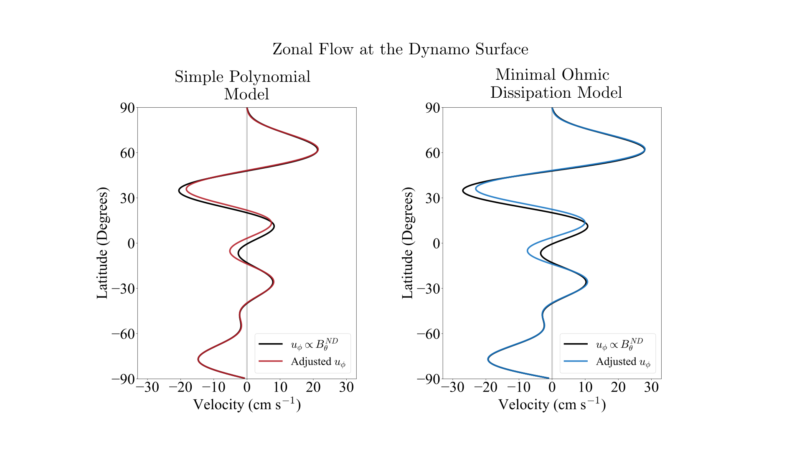

# Contributions to Jupiter’s gravity field from dynamics in the dynamo region

## Requirements 
- `Python 3+` 
- `NumPy`
- `SciPy`

## 1 Overview 

  
     
 <em>  Zonal flows occur in Jupiter's deep atmosphere and dynamo region (i.e., where the magnetic
 field is   generated). These flows are associated with density perturbations that alter the planet's gravity field. </em>  

Zonal (east-west) flows occur throughout Jupiter's interior. Near the "surface" of the planet, we observe alternating east-west jets with peak speeds of ~100 m/s. The surface winds may extend thousands of kilometers deep into the planet, or be confined to a thin weather layer on top of weaker convective flows. Deeper down, in the dynamo region where the magnetic field is generated, there are slow zonal flows with speeds on the order of 0.1-20 cm/s. The zonal flows within the deep atmosphere and dynamo region are associated with high and low pressures, and thus with density perturbations relative to the mean background density. The density perturbations induced by zonal flows alter Jupiter's gravity field.

Recently, the Juno spacecraft at Jupiter has measured the planet's gravity field with high precision. Using the Juno measurements, we can study the gravitational contributions from atmospheric and dynamo zonal flows. Atmospheric flows extending about 3,000 km deep can explain most of the structure of the observed gravity field that arises from the dynamics (Kaspi et al., 2018; Kong et al., 2018; Guillot et al., 2018). The gravity contribution from dynamo zonal flows, however, has not yet been investigated. Although these flows are slow, they occupy most of the volume of the planet and resides in a region with a large background density. The slow motion of a large volume of dense fluid has the potential to produce a large gravity signal. 

In this project, we calculate the gravity signal produced physically motivated dynamo zonal flow profiles. We begin by constructing zonal flow profiles for the dynamo region in [Section 2](#2-determining-the-zonal-flow-in-the-dynamo-region). We then develop the mathematical framework to calculate the density perturbation and gravity signal associated with the zonal flow in [Section 3](#3-gravity-calculation). We calculate the gravity signal for a few example flows in [Section 4](#4-Results). A more detailed discussion of the methods and results be found in Kulowski et al. (2020) (submitted). 
  
## 2 Determining the zonal flow in the dynamo region 

The first step in this project is to determine the zonal flow in the dynamo region. This is a difficult and underdetermined inverse problem. Instead of addressing the inverse problem, we prefer to develop a physical model of Jovian dynamo zonal flow. We simplify the dynamics so that the flow obeys Ferraro's law of isorotation. This law requires fluid parcels connected by the same magnetic field line to rotate at the same angular rate. Ferraro's law serves as a starting point for inferring possible Jovian dynamo zonal flow profiles. 

To use Ferraro’s law, we need to know the magnetic field lines in the dynamo region and the angular velocity at the dynamo surface. We assume two forms for the magnetic field. First, we consider a magnetic field where the spectral poloidal scalar has a polynomial form. Second, we consider a magnetic field that minimizes Ohmic dissipation. The two magnetic fields are shown below. 

  
     

At the dynamo surface, we assume that the zonal flow is proportional to the zonally averaged, non-dipolar theta-component of Jupiter's magnetic field. We allow for some small adjustments to this flow so that we can satisfy Ferraro's law.

  
     

We use Ferraro's law to extend the angular velocity associated with the zonal flow at the dynamo surface (red and blue curves) into the interior along the magnetic field lines. The dynamo zonal flow profiles are shown for the simple polynomial and minimal Ohmic dissipation models below. Each profile has a RMS velocity of 10 cm/s. 

  
     

## 3 Gravity calculation

There are two steps to calculate the gravity signal produced by a zonal flow profile. First, we calculate the density perturbation associated with the zonal flow using the vorticity equation, which is given by 

.

In the above equation,  is the planet's rotational angular velocity,  is the hydrostatic background density,  is the density perturbation arising from the flow, and  is the background effective gravity. Given a zonal flow profile, we integrate vorticity equation to obtain the density perturbation.

Having obtained the density perturbation, we can now calculate the gravity signal associated with it. We compute the gravity signal in spectral space, so that the gravity field is represented by zonal gravity harmonics. The zonal gravity harmonics are given by 

where  is the spherical harmonic degree,  is Jupiter's mass,  is the equatorial radius,  is the radial position,  is the Legendre polynomial of degree , and  is Jupiter's volume.

## 4 Results 

We calculate the zonal gravity harmonics (J2-J10) for our physically motivated dynamo zonal flow profiles. The zonal flow profiles with RMS velocities of 10 cm/s for the simple polynomial and minimal Ohmic dissipation magnetic field models are shown below. For each model, we allow Jupiter's core to be compact or dilute.

  

The gravity harmonics that the dynamo region significantly contributes to are highlighted in red. For all cases, the dynamo zonal flow would produce J3 values on the same order of magnitude as the Juno inferred value and J2 and J4 values on the same order as 3000 km deep atmospheric zonal flow, but would not contribute much to higher order gravity harmonics. These results can be produced by the files `simple_polynomial.py` and `minimal_ohmic_dissipation.py`.

Our results show that the dynamo region makes an important contribution to Jupiter's gravity field. While atmospheric zonal flows are capable of produce gravity harmonics that are consistent with the Juno measurements, it is not necessary for these flows to fully match the measured gravity harmonics. Some of the contribution can come from the dynamo region instead of the atmosphere. On the other hand, atmospheric zonal flows must fully explain the higher order gravity harmonics, or the smaller-scale details of Jupiter's gravity field. Therefore, when explaining the structure of Jupiter's gravity field, contributions from flows in both the dynamo region and the deep atmosphere should both be taken into account.  

## References 

1. Guillot, T., Miguel, Y., Militzer, B., Hubbard, W. B., Kaspi, Y., Galanti, E., . . . Bolton, S. J. (2018). A suppression of differential rotation in Jupiter’s deep interior. Nature, 555, 227.

2. Kaspi, Y., Galanti, E., Hubbard, W., Stevenson, D., Bolton, S., Iess, L., . . . Wahl, S. (2018). Jupiter’s atmospheric jet streams extend thousands of kilometres deep. Nature, 555(7695), 223–226. doi: 10.1038/nature25793

4. Kulowski, L., Cao, H., and Bloxham, J. Contributions to Jupiter’s gravity field from dynamics in the dynamo region. JGR Planets (in review).

5. Kong, D., Zhang, K., Schubert, G., & Anderson, J. D. (2018).
Jupiter’s cloud-level zonal winds remains a puzzle even after Juno. Proceedings of the National Academy of Sciences, 115(34), 8499–8504. 10.1073/pnas.1805927115

