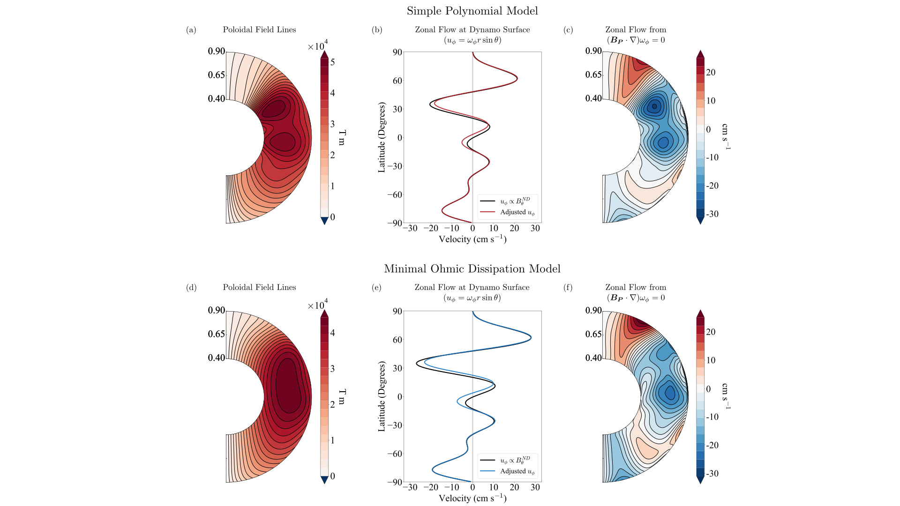

# Contributions to Jupiter’s gravity field from dynamics in the dynamo region

## Requirements 
- `Python 3+` 
- `NumPy`
- 'SciPy'

## 1 Overview 

  
     
 <em>  Zonal flows occur in Jupiter's deep atmosphere and dynamo region (i.e., where the magnetic
 field is   generated). These flows are associated with density perturbations that alter the planet's gravity field. </em>  

Zonal (east-west) flows occur throughout Jupiter's interior. Near the "surface" of the planet, we observe alternating east-west jets with peak speeds of ~100 m/s. The surface winds may extend thousands of kilometers deep into the planet, or be confined to a thin weather layer on top of weaker convective flows. Deeper down, in the dynamo region where the magnetic field is generated, there are slow zonal flows with speeds on the order of 0.1-20 cm/s. The zonal flows within the deep atmosphere and dynamo region are associated with high and low pressures, and thus with density perturbations relative to the mean background density. The density perturbations induced by zonal flows alter Jupiter's gravity field.

Zonal flows in the upper 3000 km of Jupiter's non-conducting atmosphere with amplitudes greater than a few meters per second can produce gravity signals that are consistent with the recent Juno gravity observations. The gravity contribution from flows deeper down in the dynamo region, however, have not yet been investigated. Zonal flow in the dynamo region could have a non-negligible contribution to Jupiter's gravity field. Although the dynamo zonal flow is expected to be only on the order of 0.1-20 cm/s the flow occupies most of the volume of the planet and resides in a region with a large background density. The slow motion of a large volume of dense fluid has the potential to produce a large gravity signal. 

In this project, we calculate the gravity signal produced physically motivated dynamo zonal flow profiles. We begin by constructing zonal flow profiles for the dynamo region in [Section 2](#2-determining-the-zonal-flow-in-the-dynamo-region). We then develop the mathematical framework to calculate the density perturbation and gravity signal associated with the zonal flow in [Section 3](#3-gravity-calculation). Then, we calculate the gravity signal for a few example flows in [Section 4](#4-Results). A more detailed discussion of the methods and results be found in Kulowski et al. (2020) (in review). 
  
## 2 Determining the zonal flow in the dynamo region 

The first step in this project is to determine the zonal flow in the dynamo region. We simplify the dyamics so that the flow obeys Ferraro's law of isorotation (i.e., fluid parcels connected by the same magnetic field line rotate at the same angular rate). Given the internal magnetic field and the angular velocity at the dynamo surface, we can specify the zonal flow throughout the dynamo region by extending the angular velocity at the dynamo surface into the interior along the magnetic field lines. 

A prior, we do not know the structure of Jupiter's internal magnetic field or the angular velocity at the dynamo surface. We therefore assume that they have simple forms. We consider two different models for the internal magnetic field: a simple polynomial model (i.e., the spectral poloidal scalar is has a polynomial form) and a minimal Ohmic dissipation model (i.e., where the magnetic field has a configuration that minimizes Ohmic dissipation). At the dynamo surface, we assume that the zonal flow is proportional to the zonally averaged, theta-component of Jupiter's magnetic field. We allow for some small adjustments to this flow so that we can satisfy Ferraro's law. We extend the angular velocity associated with the zonal flow at the dynamo surface into the interior along magnetic field lines to the dynamo zonal flow profile. The constructed zonal flow profiles for each magnetic field model are shown below. 

  
     

## 3 Gravity calculation

There are two steps to calculate the gravity signal produced by a zonal flow profile. First, we calculate the density perturbation associated with the zonal flow using the vorticity equation, which is given by 

where  is the planet's rotational angular velocity,  is the hydrostatic background density,  is the density perturbation arising from the flow, and  is the backgound effective gravity. Given a zonal flow profile, we integrate vorticity equation to obtain the density perturbation.

Having obtained the density perturbation, we can now calculate the gravity signal associated with it. We compute the gravity signal in spectral space, so that the gravity field is represented by zonal gravity harmonics. The zonal gravity harmonics are given by 

where  is the spherical harmonic degree,  is Jupiter's mass,  is the equatorial radius,  is the radial position,  is the Legendre polynomial of degree , and  is Jupiter's volume.

## 4 Results 

We calculate the zonal gravity harmonics (J2-J10) for our physically motivated dynamo zonal flow profiles. The zonal flow profiles with RMS velocities of 10 cm/s for the simple polynomial and minimal Ohmic dissipation magnetic field models are shown below. For each model, we allow Jupiter's core to be compact or dilute.

  

These results can be produced by the files `simple_polynomial.py` and `minimal_ohmic_dissipation.py`. For all cases, the dynamo zonal flow would produce J3 values on the same order of magnitude as the Juno inferred value and J2 and J4 values on the same order as 3000 km deep atmospheric zonal flow, but would not contribute much to higher order gravity harmonics.
